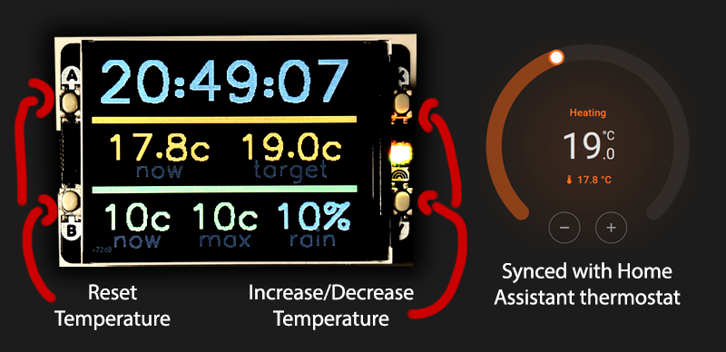

# Ae.PicoThermostat
A Raspberry Pi Pico W Thermostat for Home Assistant using the Pimoroni [Pico Display Pack 2.0](https://shop.pimoroni.com/products/pico-display-pack-2-0) or [Pico Display Pack 2.8"](https://shop.pimoroni.com/products/pico-display-pack-2-8):
* Connects to Home Assistant via WebSockets
* Updates thermostat and other configurable entities live
* Uses physical buttons to adjust temperature
* Includes a simple mangement server via HTTP
* Uses LED to indicate when heat is on
* Listens to an optional occupancy entity to switch on/off the screen



## Pre-Requisites
* Raspberry Pi Pico W running [Pimoroni Micropython](https://github.com/pimoroni/pimoroni-pico) with a Pimoroni [Pico Display Pack 2.0](https://shop.pimoroni.com/products/pico-display-pack-2-0) or [Pico Display Pack 2.8"](https://shop.pimoroni.com/products/pico-display-pack-2-8)
* Install the following libraries:
    * [ws.py](https://github.com/alanedwardes/Ae.Pico/blob/main/libraries/ws.py)
    * [hassws.py](https://github.com/alanedwardes/Ae.Pico/blob/main/libraries/hassws.py)
    * [buttons.py](https://github.com/alanedwardes/Ae.Pico/blob/main/libraries/buttons.py)
    * [management.py](https://github.com/alanedwardes/Ae.Pico/blob/main/libraries/management.py)
    * [remotetime.py](https://github.com/alanedwardes/Ae.Pico/blob/main/libraries/remotetime.py)
    * [runner.py](https://github.com/alanedwardes/Ae.Pico/blob/main/libraries/runner.py)
    * [wifi.py](https://github.com/alanedwardes/Ae.Pico/blob/main/libraries/wifi.py)

Example via [mip](https://docs.micropython.org/en/latest/reference/packages.html):
```python
> import mip
> mip.install('github:alanedwardes/Ae.Pico/libraries/example.py')
```

## Setup

Copy the `main.py` and `thermostat.py` libraries to the Pico. Copy the below as `config.py`, and customise for your use case:

```python
wifi = dict(
    ssid = "ssid",
    key = "key",
    host = "hostname"
)

hass = dict(
    url = "http://<home assistant http endpoint>",
    ws = "ws://<home assistant websockets endpoint>",
    token = "<token>"
)

thermostat = dict(
    rotate = 0, # Rotate the display by this many degrees
    leds = (6, 7, 8), # (26, 27, 28) for the Display Pack 2.8"
    entity_id = "<entity id>", # The thermostat entity ID
    occupancy_entity_id = "<entity id>", # Optional, ID of occupancy sensor
    middle_row = [
        # Can be any entity in Home Assistant - see below
        dict(entity_id = '<thermostat entity id>', attribute = 'current_temperature', label = 'now', format = lambda x: '%.1fc' % float(x), temperature = True),
        dict(entity_id = '<thermostat entity id>', attribute = 'temperature', label = 'target', format = lambda x: '%.1fc' % float(x), temperature = True)
    ],
    bottom_row = [
        # Can be any entity in Home Assistant - see below
        dict(entity_id = '<current weather entity id>', label = 'now', format = lambda x: '%.0fc' % float(x), temperature = True),
        dict(entity_id = '<maximum weather entity id>', label = 'max', format = lambda x: '%.0fc' % float(x), temperature = True),
        dict(entity_id = '<current rain chance entity id>', label = 'rain', format = lambda x: '%.0f%%' % float(x))
    ]
)

clock = dict(
    endpoint = "ntp://pool.ntp.org",
    update_time_ms = 300_000
)
```

### Sensor Row Items
The `middle_row` and `bottom_row` arrays can contain dictionaries describing any entity in Home Assistant - the thermostat doesn't have to appear there. Each entry is a dictionary consisting of the following parameters:
* **entity_id** - Required, the full entity ID, e.g. `weather.home`
* **attribute** - Optional, an attribute to obtain data from e.g. `temperature`
* **format** - Required, a func to format the value
* **label** - Required, the text to show underneath the value
* **temperature** - Optional, if `True` use temperature color scale
